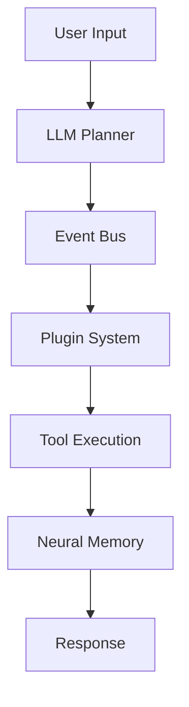

# Documentation Standards - Agent Instructions

## Overview
The `docs/` directory contains comprehensive documentation for Super Alita:
- **Architecture** - System design and component relationships
- **User Guides** - Setup, configuration, and usage instructions
- **API Documentation** - Interface specifications and examples
- **Integration Guides** - External service and tool integrations

## Documentation Structure

### Key Documentation Files
- `architecture.md` - Core system architecture and patterns
- `runtime.md` - Runtime environment and deployment
- `mcp.md` - Model Context Protocol integration
- `memory.md` - Memory and knowledge graph systems
- `testing.md` - Testing guidelines and frameworks
- `security/` - Security documentation and guidelines

## Writing Standards

### Markdown Guidelines
```markdown
# Document Title

## Overview
Brief 2-3 sentence overview of the document's purpose.

## Section Headers
Use ## for main sections, ### for subsections.

### Code Examples
All code blocks must specify the language:

```python
# Example Python code
def example_function():
    return "Hello, World!"
```

### Links and References
- Use relative links for internal docs: [Architecture](./architecture.md)
- Use absolute URLs for external links: [MCP Protocol](https://modelcontextprotocol.io/)
```

### Code Documentation Standards
```python
def example_function(param1: str, param2: int = 10) -> Dict[str, Any]:
    """
    Brief one-line description of the function.
    
    Longer description if needed, explaining the purpose,
    behavior, and any important considerations.
    
    Args:
        param1: Description of the first parameter
        param2: Description of the second parameter with default
        
    Returns:
        Dictionary containing result data with keys:
        - success: Boolean indicating operation success
        - data: The actual result data
        - error: Error message if operation failed
        
    Raises:
        ValueError: When param1 is empty or invalid
        RuntimeError: When operation cannot be completed
        
    Example:
        >>> result = example_function("test", 20)
        >>> print(result["success"])
        True
    """
    pass
```

## Architecture Documentation

### System Diagrams
```markdown
## Architecture Overview



### Component Descriptions
Each architectural component should be documented with:

```markdown
### Component Name

**Purpose**: Brief description of component's role
**Location**: `src/path/to/component.py`
**Dependencies**: List of key dependencies
**Interfaces**: APIs and event contracts

#### Key Responsibilities
- Specific responsibility 1
- Specific responsibility 2
- Specific responsibility 3

#### Configuration
```python
# Example configuration
COMPONENT_CONFIG = {
    "setting1": "value1",
    "setting2": 42
}
```

#### Events
- **Emits**: `event_type_1`, `event_type_2`
- **Handles**: `input_event_1`, `input_event_2`
```

## API Documentation

### Endpoint Documentation
```markdown
### POST /api/v1/endpoint

Execute specific operation on the system.

#### Request
```json
{
  "parameter1": "string",
  "parameter2": 123,
  "optional_param": "optional_value"
}
```

#### Response
```json
{
  "success": true,
  "result": {
    "data": "result_data",
    "metadata": {
      "timestamp": "2024-01-01T00:00:00Z",
      "processing_time": 1.23
    }
  }
}
```

#### Error Response
```json
{
  "success": false,
  "error": {
    "code": "VALIDATION_ERROR",
    "message": "Parameter validation failed",
    "details": {
      "field": "parameter1",
      "reason": "Required field missing"
    }
  }
}
```

#### Examples
```bash
# cURL example
curl -X POST http://localhost:8080/api/v1/endpoint \
  -H "Content-Type: application/json" \
  -d '{"parameter1": "test", "parameter2": 123}'
```

```python
# Python example
import aiohttp

async def call_endpoint():
    async with aiohttp.ClientSession() as session:
        data = {"parameter1": "test", "parameter2": 123}
        async with session.post("/api/v1/endpoint", json=data) as response:
            return await response.json()
```
```

## Integration Documentation

### External Service Integration
```markdown
### Service Name Integration

#### Overview
Brief description of the integration purpose and benefits.

#### Prerequisites
- Service account setup
- API key configuration
- Network access requirements

#### Configuration
```python
# Environment variables
SERVICE_API_KEY=your_api_key_here
SERVICE_BASE_URL=https://api.service.com
SERVICE_TIMEOUT=30
```

#### Setup Steps
1. Create service account at [Service Portal](https://service.com)
2. Generate API key
3. Add configuration to `.env`
4. Test connection: `python test_service_integration.py`

#### Usage Examples
```python
from src.integrations.service_integration import ServiceClient

client = ServiceClient()
result = await client.perform_operation(data)
```

#### Troubleshooting
- **Connection timeouts**: Check network and increase timeout
- **Authentication errors**: Verify API key configuration
- **Rate limiting**: Implement exponential backoff
```

## User Guide Standards

### Step-by-Step Instructions
```markdown
### Getting Started Guide

#### Prerequisites
- Python 3.11 or higher
- Git installed
- 8GB RAM minimum

#### Installation
1. **Clone repository**
   ```bash
   git clone https://github.com/yaboyshades/super-alita.git
   cd super-alita
   ```

2. **Install dependencies**
   ```bash
   pip install -r requirements.txt
   ```

3. **Configure environment**
   ```bash
   cp .env.example .env
   # Edit .env with your configuration
   ```

4. **Run system**
   ```bash
   python -m src.main
   ```

#### Verification
Test that everything works correctly:

```bash
# Test core functionality
curl http://localhost:8080/health

# Expected response
{"status": "healthy", "timestamp": "2024-01-01T00:00:00Z"}
```
```

## Documentation Maintenance

### Review Process
1. **Technical Accuracy** - Verify all code examples work
2. **Completeness** - Ensure all features are documented
3. **Clarity** - Check for clear, unambiguous language
4. **Currency** - Update for recent changes

### Documentation Testing
```python
# test_documentation.py
import subprocess
import pytest
from pathlib import Path

def test_code_examples_in_docs():
    """Test that code examples in documentation actually work"""
    
    docs_dir = Path("docs")
    
    for doc_file in docs_dir.glob("**/*.md"):
        # Extract code blocks and test them
        content = doc_file.read_text()
        code_blocks = extract_python_code_blocks(content)
        
        for code_block in code_blocks:
            # Test if code is syntactically valid
            try:
                compile(code_block, f"{doc_file}:code_block", "exec")
            except SyntaxError as e:
                pytest.fail(f"Syntax error in {doc_file}: {e}")

def test_links_are_valid():
    """Test that all internal links in docs are valid"""
    
    docs_dir = Path("docs")
    
    for doc_file in docs_dir.glob("**/*.md"):
        content = doc_file.read_text()
        internal_links = extract_internal_links(content)
        
        for link in internal_links:
            target_file = (doc_file.parent / link).resolve()
            if not target_file.exists():
                pytest.fail(f"Broken link in {doc_file}: {link}")
```

### Automated Documentation
```python
# scripts/generate_api_docs.py
"""Generate API documentation from code"""

import ast
import inspect
from pathlib import Path
from typing import List, Dict

def generate_api_docs():
    """Generate API documentation from source code"""
    
    src_dir = Path("src")
    api_modules = []
    
    # Find all API modules
    for py_file in src_dir.glob("**/*api*.py"):
        module_info = extract_api_info(py_file)
        if module_info:
            api_modules.append(module_info)
    
    # Generate markdown documentation
    doc_content = generate_markdown_docs(api_modules)
    
    # Write to docs directory
    output_file = Path("docs/api_reference.md")
    output_file.write_text(doc_content)

def extract_api_info(file_path: Path) -> Dict:
    """Extract API information from Python file"""
    
    with open(file_path) as f:
        tree = ast.parse(f.read())
    
    functions = []
    classes = []
    
    for node in ast.walk(tree):
        if isinstance(node, ast.FunctionDef):
            if node.name.startswith("api_"):
                functions.append(extract_function_info(node))
        elif isinstance(node, ast.ClassDef):
            if "API" in node.name:
                classes.append(extract_class_info(node))
    
    return {
        "file": file_path,
        "functions": functions,
        "classes": classes
    }
```

## Documentation Templates

### New Feature Documentation Template
```markdown
# Feature Name

## Overview
Brief description of the feature and its purpose.

## Use Cases
- Primary use case 1
- Primary use case 2
- Edge case or advanced usage

## API Reference

### Functions/Classes
```python
def feature_function(param1: str, param2: int = 10) -> FeatureResult:
    """Function description"""
    pass
```

### Configuration
```python
FEATURE_CONFIG = {
    "enabled": True,
    "setting1": "value1"
}
```

## Examples

### Basic Usage
```python
from src.features.feature_name import FeatureClass

feature = FeatureClass()
result = feature.perform_operation("input")
```

### Advanced Usage
```python
# Advanced configuration example
feature = FeatureClass(config={
    "advanced_setting": True,
    "custom_value": 42
})
```

## Integration
How this feature integrates with other system components.

## Testing
How to test this feature.

## Troubleshooting
Common issues and solutions.
```

### Integration Guide Template
```markdown
# Service Integration Guide

## Overview
What the integration provides and why it's useful.

## Prerequisites
- Account requirements
- Technical requirements
- Dependencies

## Setup
Step-by-step setup instructions.

## Configuration
Configuration options and examples.

## Usage
How to use the integration in practice.

## Examples
Real-world usage examples.

## Troubleshooting
Common problems and solutions.

## Reference
Links to external documentation and resources.
```

## Quality Guidelines

### Writing Best Practices
- **Clarity**: Use simple, direct language
- **Accuracy**: Test all code examples
- **Completeness**: Cover all important aspects
- **Consistency**: Follow established patterns
- **Maintainability**: Keep docs up-to-date with code

### Review Checklist
- [ ] All code examples are tested and working
- [ ] Links are valid and up-to-date
- [ ] Screenshots are current and helpful
- [ ] Grammar and spelling are correct
- [ ] Technical accuracy is verified
- [ ] Examples cover common use cases
- [ ] Troubleshooting section is comprehensive

### Documentation Metrics
```python
def calculate_documentation_metrics():
    """Calculate documentation coverage and quality metrics"""
    
    metrics = {
        "coverage": {
            "functions_documented": 0,
            "classes_documented": 0,
            "modules_documented": 0
        },
        "quality": {
            "broken_links": 0,
            "outdated_examples": 0,
            "missing_examples": 0
        }
    }
    
    # Implementation would analyze source code and docs
    return metrics
```

## Documentation Tools

### Recommended Tools
- **Mermaid** - For diagrams and flowcharts
- **PlantUML** - For UML diagrams
- **Markdown linters** - For consistency checking
- **Link checkers** - For validating links
- **Code formatters** - For consistent code style

### Automation Scripts
```bash
# scripts/check_docs.sh
#!/bin/bash

# Check for broken links
markdown-link-check docs/**/*.md

# Lint markdown files
markdownlint docs/

# Test code examples
python tests/test_documentation.py

# Generate API docs
python scripts/generate_api_docs.py
```