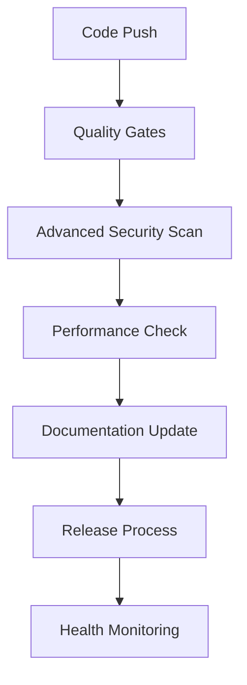

# 🤖 Super Alita Comprehensive Workflow Automation

This document provides a complete overview of all automation workflows implemented in the Super Alita repository, including existing sophisticated workflows and newly added automation capabilities.

## 📋 Complete Workflow Inventory

### 🔄 Core Automation Workflows (Existing)

#### 1. Smart Release & Deployment (`smart-release.yml`)
**Purpose**: Automates the entire release process from version calculation to deployment.
- **Triggers**: Push to `master`/`main`, manual dispatch
- **Features**: Semantic versioning, changelog generation, multi-artifact builds, deployment
- **Integration**: FastAPI, VS Code extensions, WASM components

#### 2. Intelligent Dependency Updates (`intelligent-dependency-updates.yml`)
**Purpose**: Keeps dependencies up-to-date with smart testing and security-first approach.
- **Triggers**: Weekly schedule, manual dispatch
- **Features**: Security/patch/minor/major categorization, auto-merge safe updates
- **Integration**: Python packages, Node.js dependencies

#### 3. Performance Monitoring & Regression Detection (`performance-monitoring.yml`)
**Purpose**: Continuously monitors performance across all components.
- **Triggers**: Push to main, PRs, daily schedule
- **Features**: Python benchmarks, VS Code extension monitoring, WASM benchmarking
- **Integration**: Historical baselines, PR impact analysis

#### 4. AI-Powered Code Review (`ai-code-review.yml`)
**Purpose**: Provides intelligent code analysis and review suggestions.
- **Triggers**: PR opened/updated, manual dispatch
- **Features**: DeepCode integration, security scanning, complexity analysis
- **Integration**: Multiple language support, reviewer suggestions

#### 5. Intelligent Issue & PR Management (`intelligent-issue-pr-management.yml`)
**Purpose**: Automates issue and PR lifecycle management.
- **Triggers**: Issues/PRs opened/edited, weekly maintenance
- **Features**: Auto-labeling, smart assignment, stale management
- **Integration**: Content analysis, component expertise mapping

#### 6. Workflow Orchestrator & Health Dashboard (`workflow-orchestrator.yml`)
**Purpose**: Monitors overall automation health and provides operational dashboard.
- **Triggers**: Workflow completion, daily schedule, manual dispatch
- **Features**: Health monitoring, metrics collection, emergency controls
- **Integration**: Dashboard generation, system alerting

#### 7. Automatic Merge Conflict Resolution (`auto-merge-conflict-resolution.yml`)
**Purpose**: Automatically detects and resolves merge conflicts.
- **Triggers**: PR events, comment commands, manual dispatch
- **Features**: Intelligent strategies, automatic PR creation
- **Integration**: Git workflow automation

#### 8. Enhanced Quality Gates (`enhanced-quality-gates.yml`)
**Purpose**: Enforces code quality standards before merging.
- **Triggers**: PR events
- **Features**: Multi-stage validation, quality metrics
- **Integration**: Testing pipelines, static analysis

#### 9. Capability Validate (`capability-validate.yml`)
**Purpose**: Validates system capabilities and functionality.
- **Triggers**: Various events
- **Features**: Comprehensive validation
- **Integration**: System health checks

#### 10. Copilot Setup (`copilot-setup.yml`)
**Purpose**: Automates GitHub Copilot integration setup.
- **Triggers**: Repository setup events
- **Features**: Configuration automation
- **Integration**: VS Code extensions

#### 11. Dependencies and Tests (`deps-and-tests.yml`)
**Purpose**: Manages dependency installation and test execution.
- **Triggers**: Various development events
- **Features**: Dependency management, test automation
- **Integration**: Python/Node.js ecosystems

#### 12. Update Agents MD (`update-agents-md.yml`)
**Purpose**: Automatically updates agent documentation.
- **Triggers**: Documentation changes
- **Features**: Agent instruction updates
- **Integration**: Documentation system

### 🚀 Enhanced Development Automation (New)

#### 13. Advanced Code Quality & Security (`advanced-code-quality.yml`)
**Purpose**: Comprehensive security and quality analysis beyond basic checks.
- **Triggers**: Push to main, PRs, weekly schedule, manual dispatch
- **Features**:
  - **Security Scanning**: Bandit, Safety, Semgrep integration
  - **License Compliance**: Automated license checking and violation detection
  - **Code Complexity**: Radon analysis with complexity thresholds
  - **Dependency Auditing**: SBOM generation, vulnerability tracking
  - **Quality Reporting**: Comprehensive reports with actionable recommendations
- **Integration**: PR comments, artifact storage, quality gates

#### 14. Development Environment Automation (`dev-environment-automation.yml`)
**Purpose**: Automates development environment setup and validation.
- **Triggers**: Environment file changes, manual dispatch
- **Features**:
  - **Multi-Platform Validation**: Windows, macOS, Linux support
  - **Python Version Testing**: 3.11 and 3.12 compatibility
  - **Docker Integration**: Container build and testing
  - **Setup Documentation**: Auto-generated setup guides
  - **Environment Health**: Validation and troubleshooting
- **Integration**: Docker, Make, validation scripts

#### 15. Documentation Automation (`documentation-automation.yml`)
**Purpose**: Automates documentation generation, validation, and maintenance.
- **Triggers**: Code changes, documentation changes, weekly schedule
- **Features**:
  - **API Documentation**: Auto-generation from docstrings and FastAPI
  - **Link Validation**: Broken link detection and reporting
  - **Coverage Analysis**: Documentation coverage metrics
  - **Changelog Generation**: Conventional commit-based changelogs
  - **ADR Management**: Architecture Decision Records automation
- **Integration**: Sphinx, OpenAPI, markdown tooling

#### 16. Repository Organization & Maintenance (`repository-organization.yml`)
**Purpose**: Automated repository maintenance and organization.
- **Triggers**: Weekly schedule, manual dispatch
- **Features**:
  - **Structure Validation**: Repository structure compliance
  - **Code Metrics**: Comprehensive codebase analysis
  - **Unused Code Detection**: Dead code and unused import identification
  - **File Cleanup**: Automated file organization and cleanup
  - **Maintenance Reporting**: Weekly maintenance summaries
- **Integration**: Code analysis tools, cleanup automation

### 🎯 Workflow Organization & Categories

#### **Security & Quality** (4 workflows)
- `ai-code-review.yml` - AI-powered code review
- `advanced-code-quality.yml` - Comprehensive security scanning
- `enhanced-quality-gates.yml` - Quality enforcement
- `performance-monitoring.yml` - Performance analysis

#### **Development & Environment** (3 workflows)
- `dev-environment-automation.yml` - Environment setup and validation
- `deps-and-tests.yml` - Dependency and test management
- `copilot-setup.yml` - Development tool setup

#### **Documentation & Communication** (3 workflows)
- `documentation-automation.yml` - Documentation generation
- `intelligent-issue-pr-management.yml` - Issue and PR automation
- `update-agents-md.yml` - Agent documentation updates

#### **Release & Deployment** (2 workflows)
- `smart-release.yml` - Release automation
- `intelligent-dependency-updates.yml` - Dependency management

#### **Maintenance & Operations** (4 workflows)
- `repository-organization.yml` - Repository maintenance
- `workflow-orchestrator.yml` - Health monitoring
- `auto-merge-conflict-resolution.yml` - Conflict resolution
- `capability-validate.yml` - System validation

## 🔧 Integration Architecture

### **Event-Driven System**
All workflows are designed to work together through:
- **Shared Artifacts**: Reports and metrics shared between workflows
- **Event Triggers**: Workflows trigger each other for comprehensive automation
- **Central Monitoring**: Orchestrator tracks all automation health
- **Unified Reporting**: Consolidated dashboards and summaries

### **Automation API Integration**
- **Cortex System**: Leverages existing `cortex/automation/` framework
- **Event Bus**: Integrates with core event bus system
- **Plugin Architecture**: Works with modular plugin system
- **MCP Integration**: Supports Model Context Protocol workflows

### **Quality Gates & Dependencies**

## 📊 Automation Metrics & KPIs

### **Coverage Metrics**
- **16 Total Workflows**: Comprehensive automation coverage
- **5 Trigger Types**: Push, PR, Schedule, Manual, Event-driven
- **4 Platform Support**: Linux, Windows, macOS, Docker
- **10+ Tool Integrations**: From security to documentation

### **Quality Indicators**
- **Security**: Multi-tool vulnerability scanning (Bandit, Safety, Semgrep)
- **Performance**: Continuous regression detection with baselines
- **Documentation**: Automated generation and validation
- **Maintenance**: Proactive cleanup and organization

### **Efficiency Gains**
- **Automated PR Reviews**: Intelligent analysis and suggestions
- **Zero-Touch Releases**: Semantic versioning and deployment
- **Proactive Maintenance**: Weekly cleanup and organization
- **Environment Validation**: Multi-platform compatibility checks

## 🚀 Future Enhancement Opportunities

### **Phase 5: AI-Enhanced Workflows** (Planned)
1. **Intelligent Test Generation** - AI-powered test creation from code changes
2. **Smart Bug Triaging** - Automated issue classification and routing
3. **Performance Optimization** - AI-suggested performance improvements
4. **Documentation Intelligence** - Smart documentation suggestions

### **Advanced Integration Possibilities**
1. **ML-Powered Predictions** - Failure prediction and prevention
2. **Advanced Analytics** - Deeper insights and trend analysis
3. **Custom Dashboards** - Project-specific monitoring views
4. **External Tool Integration** - Additional services and platforms

### **Scalability Enhancements**
1. **Workflow Templates** - Reusable automation patterns
2. **Organization-Wide Deployment** - Multi-repository automation
3. **Custom Automation Framework** - Super Alita-specific automation tools
4. **Real-time Monitoring** - Live system health and performance tracking

## 🎯 Implementation Recommendations

### **Immediate Actions**
1. **Monitor New Workflows**: Validate new automation workflows work correctly
2. **Customize Settings**: Adjust thresholds and configurations for your needs
3. **Review Reports**: Analyze generated reports for actionable insights
4. **Documentation**: Update team processes to leverage new automation

### **Short-term Goals (1-2 weeks)**
1. **Team Training**: Educate team on new automation capabilities
2. **Process Integration**: Incorporate automation into development workflow
3. **Threshold Tuning**: Optimize quality gates and alert thresholds
4. **Custom Rules**: Add project-specific automation rules

### **Long-term Strategy (1-3 months)**
1. **Metrics Analysis**: Track automation effectiveness and ROI
2. **Workflow Optimization**: Refine automation based on usage patterns
3. **Advanced Features**: Implement Phase 5 AI-enhanced workflows
4. **Organization Scaling**: Expand automation to other repositories

## 📚 Resources & Documentation

### **Workflow Documentation**
- [Powerful GitHub Workflows](docs/POWERFUL_GITHUB_WORKFLOWS.md) - Original workflow documentation
- [Automation Dashboard](docs/AUTOMATION_DASHBOARD.md) - Live automation health
- [Development Setup Guide](docs/DEVELOPMENT_SETUP_GUIDE.md) - Environment setup

### **Configuration Files**
- `.github/workflows/` - All workflow definitions
- `cortex/automation/` - Automation backend code
- `.env.example` - Environment configuration template
- `pyproject.toml` - Project and tool configuration

### **Monitoring & Health**
- **Dashboard Issue**: Auto-updated with system health
- **Weekly Reports**: Automated maintenance summaries
- **Artifact Storage**: Historical reports and metrics
- **Emergency Controls**: Workflow orchestrator emergency stops

---

**Note**: This documentation is automatically maintained by the automation system. The comprehensive workflow suite represents a state-of-the-art development automation platform that enhances productivity, ensures quality, and maintains system health through intelligent automation.

*Total Workflows: 16 | Coverage: Complete Development Lifecycle | Status: Production Ready*