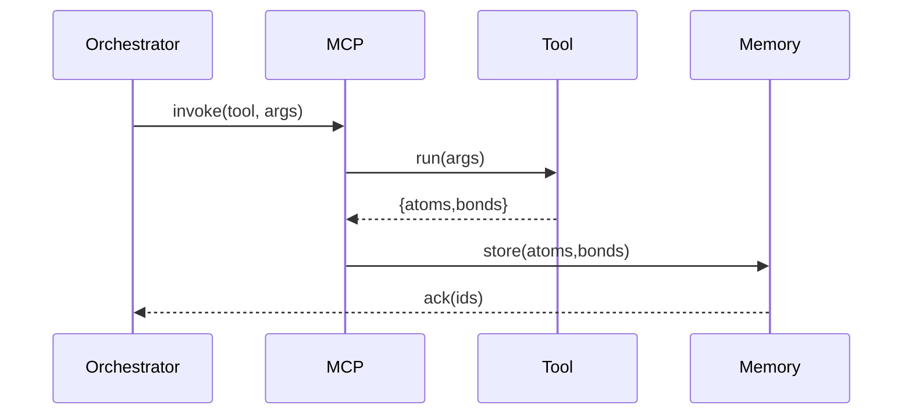
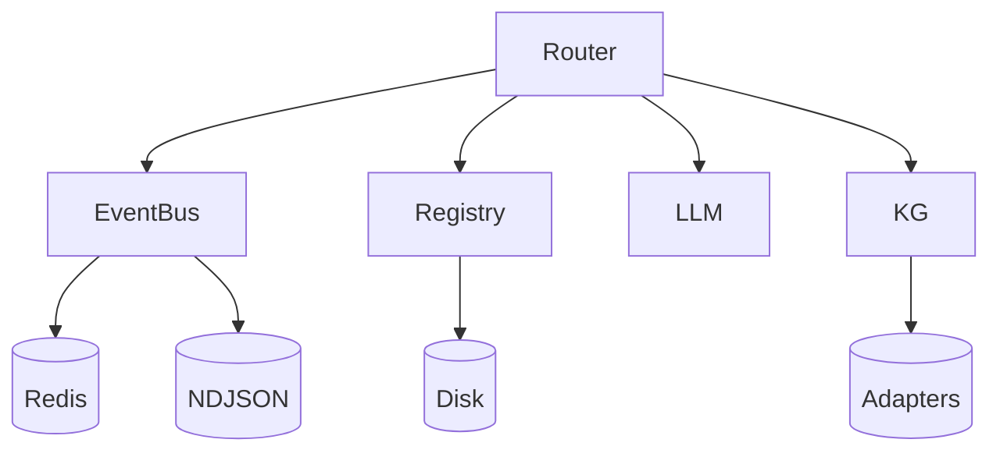

# Architecture

Super Alita follows **minimal predefinition, maximal self-evolution**.

- **MCP + Registry**: creates/loads tools at runtime. Tools are **atom factories**.
- **Atoms/Bonds**: a unified cognitive fabric. All tool outputs are atoms/bonds.
- **Memory**: idempotent graph store with lineage queries.
- **Flow**:

- **Deterministic Identity**: UUIDv5 seeded by normalized content + type + title.
- **Provenance**: standardized in `meta.provenance` (source/activity/timestamp/context/parents).

## Runtime dependency graph

