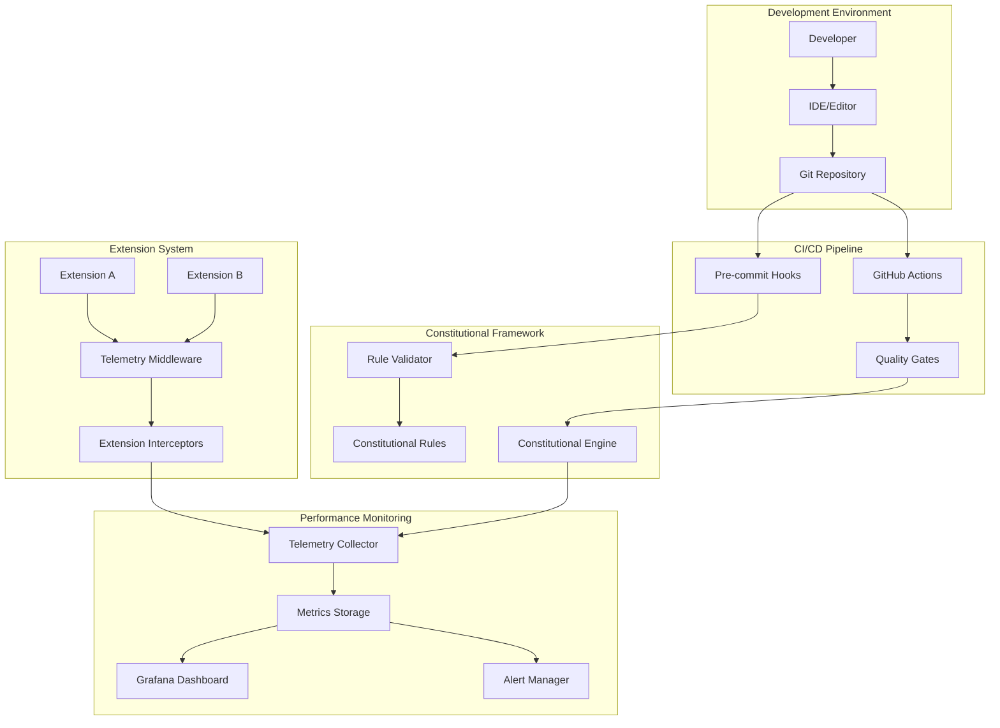
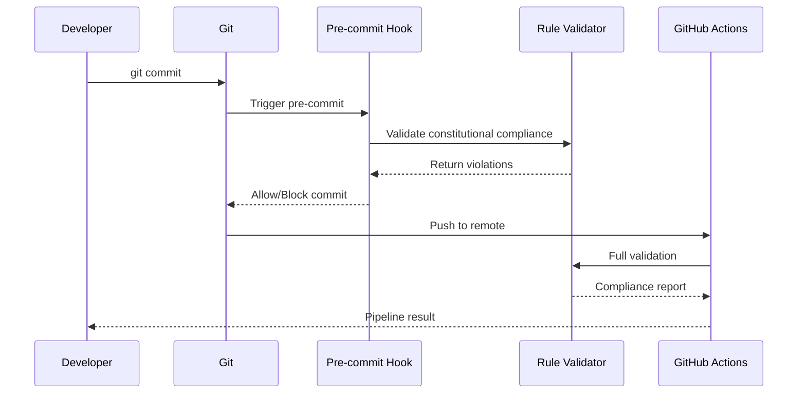
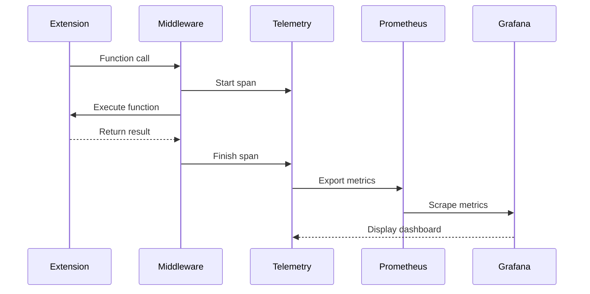
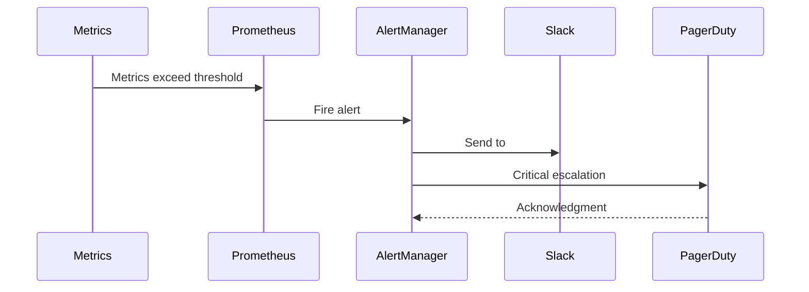

# Super Alita Architecture Overview

## System Architecture


```mermaid
graph TB
    subgraph "Development Environment"
        DEV[Developer]
        IDE[IDE/Editor]
        GIT[Git Repository]
    end

    subgraph "Constitutional Framework"
        RULES[Constitutional Rules]
        VALIDATOR[Rule Validator]
        ENGINE[Constitutional Engine]
    end

    subgraph "Performance Monitoring"
        TELEMETRY[Telemetry Collector]
        METRICS[Metrics Storage]
        DASHBOARD[Grafana Dashboard]
        ALERTS[Alert Manager]
    end

    subgraph "CI/CD Pipeline"
        PRECOMMIT[Pre-commit Hooks]
        GITHUB[GitHub Actions]
        QUALITY[Quality Gates]
    end

    subgraph "Extension System"
        EXT1[Extension A]
        EXT2[Extension B]
        MIDDLEWARE[Telemetry Middleware]
        INTERCEPTOR[Extension Interceptors]
    end

    DEV --> IDE
    IDE --> GIT
    GIT --> PRECOMMIT
    PRECOMMIT --> VALIDATOR
    VALIDATOR --> RULES

    GIT --> GITHUB
    GITHUB --> QUALITY
    QUALITY --> ENGINE

    EXT1 --> MIDDLEWARE
    EXT2 --> MIDDLEWARE
    MIDDLEWARE --> INTERCEPTOR
    INTERCEPTOR --> TELEMETRY

    TELEMETRY --> METRICS
    METRICS --> DASHBOARD
    METRICS --> ALERTS

    ENGINE --> TELEMETRY
```

## Component Overview

### 1. Constitutional Framework
The core governance system ensuring code quality and compliance.

**Components:**
- **Constitutional Rules**: YAML-defined rules based on six articles
- **Rule Validator**: CLI tool for compliance checking
- **Constitutional Engine**: Runtime compliance validation

**Key Features:**
- Six-article constitutional framework
- Semantic versioning for rules
- BLOCKER/WARNING severity levels
- Automated violation detection

### 2. Performance Monitoring
Comprehensive monitoring and alerting system with SLO tracking.

**Components:**
- **OpenTelemetry Collector**: Metrics collection with structured logging
- **Prometheus**: Time-series metrics storage
- **Grafana**: Visualization and dashboards
- **AlertManager**: Alert routing and notification

**Key Features:**
- p95 latency < 1s SLO monitoring
- Error rate < 2% tracking
- 100% error capture, 10% success sampling
- Real-time dashboard with business impact alerts

### 3. Extension Telemetry Middleware
Automatic performance tracking for all extension interactions.

**Components:**
- **Extension Interceptors**: Decorators for automatic telemetry
- **Telemetry Middleware**: Context propagation and sampling
- **Performance Threshold Monitor**: SLO violation detection

**Key Features:**
- Automatic instrumentation via decorators
- Context propagation across async boundaries
- Configurable sampling rates
- Payload size tracking

### 4. CI/CD Integration
Automated quality assurance and deployment pipeline.

**Components:**
- **Pre-commit Hooks**: Local validation before commit
- **GitHub Actions**: Automated CI/CD pipeline
- **Quality Gates**: Multi-stage validation process

**Key Features:**
- Constitutional compliance blocking
- Automated test execution
- Performance regression detection
- Structured reporting

## Data Flow

### 1. Development Workflow

```mermaid
sequenceDiagram
    participant Dev as Developer
    participant Git as Git
    participant Hook as Pre-commit Hook
    participant Val as Rule Validator
    participant CI as GitHub Actions

    Dev->>Git: git commit
    Git->>Hook: Trigger pre-commit
    Hook->>Val: Validate constitutional compliance
    Val-->>Hook: Return violations
    Hook-->>Git: Allow/Block commit
    Git->>CI: Push to remote
    CI->>Val: Full validation
    Val-->>CI: Compliance report
    CI-->>Dev: Pipeline result
```

### 2. Extension Monitoring

```mermaid
sequenceDiagram
    participant Ext as Extension
    participant Mid as Middleware
    participant Tel as Telemetry
    participant Prom as Prometheus
    participant Graf as Grafana

    Ext->>Mid: Function call
    Mid->>Tel: Start span
    Mid->>Ext: Execute function
    Ext-->>Mid: Return result
    Mid->>Tel: Finish span
    Tel->>Prom: Export metrics
    Prom->>Graf: Scrape metrics
    Graf-->>Tel: Display dashboard
```

### 3. Alert Pipeline

```mermaid
sequenceDiagram
    participant Met as Metrics
    participant Prom as Prometheus
    participant Alert as AlertManager
    participant Slack as Slack
    participant Page as PagerDuty

    Met->>Prom: Metrics exceed threshold
    Prom->>Alert: Fire alert
    Alert->>Slack: Send to #ops-alerts
    Alert->>Page: Critical escalation
    Page-->>Alert: Acknowledgment
```

## Directory Structure

```
super-alita-clean/
├── src/                              # Source code
│   ├── performance_monitoring/       # Monitoring components
│   │   ├── telemetry/               # OpenTelemetry config
│   │   ├── middleware/              # Extension interceptors
│   │   ├── automation/              # Workflow engine
│   │   └── core/                    # Core monitoring logic
│   └── ...
├── rules/                           # Constitutional framework
│   └── constitution/                # Constitutional rules (YAML)
├── scripts/                         # Utility scripts
│   └── rule_validator.py           # Constitutional validator CLI
├── monitoring/                      # Monitoring stack
│   ├── grafana/                    # Dashboards and config
│   ├── prometheus/                 # Prometheus config
│   └── alertmanager/               # Alert rules
├── tests/                          # Test suite
├── docs/                           # Documentation
└── .github/                        # CI/CD workflows
```

## Technology Stack

### Core Technologies
- **Python 3.11+**: Primary development language
- **OpenTelemetry**: Distributed tracing and metrics
- **Prometheus**: Metrics collection and storage
- **Grafana**: Visualization and dashboards
- **YAML**: Rule definition format

### Development Tools
- **Pre-commit**: Code quality automation
- **GitHub Actions**: CI/CD pipeline
- **pytest**: Testing framework
- **black**: Code formatting
- **flake8**: Code linting

### Monitoring Stack
- **Docker Compose**: Container orchestration
- **AlertManager**: Alert routing
- **Node Exporter**: System metrics
- **Slack/PagerDuty**: Notification channels

## Performance Characteristics

### Service Level Objectives (SLOs)
- **Latency p95**: < 1000ms
- **Error Rate**: < 2%
- **Availability**: > 99.9%
- **Resource Usage**: CPU < 80%, Memory < 70%

### Scalability Metrics
- **Throughput**: 1000+ extension calls/second
- **Telemetry Overhead**: < 5% performance impact
- **Storage Retention**: 30 days metrics, 90 days aggregates
- **Alert Response**: < 2 minutes to notification

## Security Considerations

### Data Protection
- No sensitive data in telemetry spans
- Payload size limits (5KB max)
- Secure metric endpoints
- Role-based dashboard access

### Access Control
- GitHub repository permissions
- Grafana authentication required
- AlertManager webhook security
- Prometheus scrape endpoint protection

## Future Enhancements

### Planned Features
1. **Machine Learning Integration**: Anomaly detection and predictive analysis
2. **Advanced Rule Engine**: Dynamic rule loading and custom validators
3. **Multi-tenant Support**: Isolated environments and metrics
4. **Enhanced Visualizations**: Custom dashboard components

### Roadmap
- **Q1**: Advanced telemetry correlation
- **Q2**: Intelligent alert routing
- **Q3**: Automated remediation workflows
- **Q4**: ML-powered performance optimization

## Troubleshooting

### Common Issues
1. **High Latency**: Check system resources and extension performance
2. **Missing Metrics**: Verify Prometheus scraping configuration
3. **Failed Validation**: Review constitutional rule violations
4. **Alert Fatigue**: Tune alert thresholds and routing

### Monitoring Health
- Prometheus target status: http://localhost:9090/targets
- Grafana dashboards: http://localhost:3000
- AlertManager status: http://localhost:9093
- Application metrics: http://localhost:9464/metrics

## Related Documentation
- [Contributing Guide](../CONTRIBUTING.md)
- [Performance Monitoring Implementation](../PERFORMANCE_MONITORING_IMPLEMENTATION_SUMMARY.md)
- [Constitutional Rules](../rules/constitution/)
- [API Documentation](api.md)