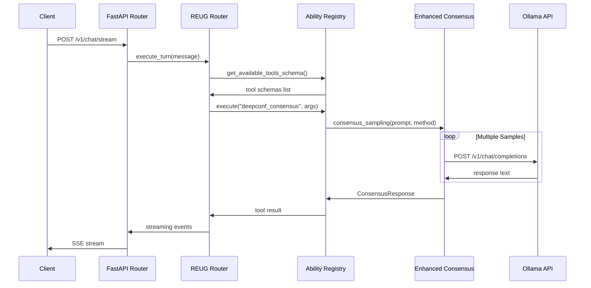

# Super Alita v3.0 Repository Integration Map

## Entry Points Flow

```
┌─────────────────────────────────────────────────────────────────┐
│                     ENTRY POINTS                                │
├─────────────────────────────────────────────────────────────────┤
│ src/main.py              ← Main FastAPI application factory     │
│ app.py                   ← uvicorn entrypoint wrapper           │
│ start_super_alita.py     ← Comprehensive launcher (CURRENT)     │
│ start.py                 ← Unified launcher (PROPOSED)          │
└─────────────────────────────────────────────────────────────────┘
                                    │
                                    ▼
┌─────────────────────────────────────────────────────────────────┐
│                   RUNTIME FLOW                                  │
├─────────────────────────────────────────────────────────────────┤
│ /v1/chat/stream          ← FastAPI endpoint                     │
│        │                                                        │
│        ▼                                                        │
│ src/reug_runtime/router.py → execute_turn()                     │
│        │                                                        │
│        ▼                                                        │
│ SimpleAbilityRegistry    ← Tool discovery & execution           │
│        │                                                        │
│        ▼                                                        │
│ EnhancedConsensusProvider ← Consensus algorithms                │
└─────────────────────────────────────────────────────────────────┘
                                    │
                                    ▼
┌─────────────────────────────────────────────────────────────────┐
│                 ABILITY DISCOVERY                               │
├─────────────────────────────────────────────────────────────────┤
│ src/abilities/registry_auto.py → auto_register_abilities()      │
│        │                                                        │
│        ▼                                                        │
│ Scans: src/abilities/*.py                                       │
│        │                                                        │
│        ▼                                                        │
│ Patterns:                                                       │
│   1. register_abilities(registry) function                      │
│   2. ABILITY_CONTRACTS + EXECUTORS dicts                       │
│   3. Provider classes with get_tools()                         │
└─────────────────────────────────────────────────────────────────┘
```

## Sequence Diagram: Chat Stream → Consensus



## Orphaned Components Analysis

| File Path | Type | Status | Notes |
|-----------|------|--------|-------|
| `demo_github_integration.py` | Demo Script | 🔴 Orphaned | No feature flag, direct imports |
| `demo_perplexica_integration.py` | Demo Script | 🔴 Orphaned | No feature flag, mock EventBus |
| `test_autogen_registry.py` | Test Script | 🔴 Orphaned | Not in tests/ directory |
| `start_super_alita_20b.py` | Launcher | 🔴 Duplicate | Specialized for gpt-oss:20b |
| `start_optimized.py` | Launcher | 🔴 Duplicate | Performance variant |
| `start_with_20b.py` | Launcher | 🔴 Duplicate | Another 20b variant |
| `start_server_test.py` | Launcher | 🔴 Duplicate | Test variant |

## Integration Architecture

### Current State
- **Multiple Entry Points**: 8+ start scripts with overlapping functionality
- **No Feature Flags**: Demo scripts run directly without environment controls
- **Registry Auto-Discovery**: Works but not unified with demo gating
- **Health Endpoints**: Present in main.py (`/health`, `/healthz`)

### Proposed State  
- **Unified Launcher**: Single `start.py` with mode selection
- **Feature-Flagged Demos**: Environment variables control demo availability
- **Unified Registry**: `src/abilities/unified_registry.py` combines auto-discovery + demo gating
- **Resilient Router**: `src/reug_runtime/unified_router.py` with timeouts/retries

## Environment Variables for Feature Flags

```bash
# Demo Feature Flags (PROPOSED)
ENABLE_GITHUB_DEMO=false
ENABLE_PERPLEXICA_DEMO=false  
ENABLE_AUTOGEN_DEMO=false

# Existing Registry Controls
ALITA_ABILITIES_INCLUDE=  # comma-separated module names
ALITA_ABILITIES_EXCLUDE=  # comma-separated module names
```

## Refactoring Impact Assessment

### Low Risk (Additive Changes)
- ✅ Add `start.py` unified launcher
- ✅ Add `src/abilities/unified_registry.py` 
- ✅ Add `src/reug_runtime/unified_router.py`
- ✅ Add feature flag support

### Medium Risk (Modifications)
- ⚠️ Update `src/main.py` health endpoint (already exists)
- ⚠️ Environment variable integration

### High Risk (Deletions - AVOID)
- ❌ Delete existing start scripts (preserve for compatibility)
- ❌ Modify core registry contracts  
- ❌ Change streaming endpoint paths